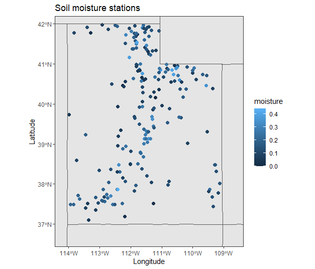

```{r setup, include=FALSE}
knitr::opts_chunk$set(echo = TRUE)

# Libraries
library(knitr)
library(tidyverse)
```

## Table of contents

* [Problem](#problem)
* [Data collection](#data_collection)
* [Data processing](#data_processing)
* [Partitioning approach](#partitioning_approach)
* [Analysis of partitions](#partition_analysis)
# [Discussion](#discussion)

## Problem {#problem}

In the state of Utah, there are 265 soil moisture sensing stations. Soil moisture will change nearly every day depending upon rainfall and climatic patterns. The following is one example measurement day of soil moisture:



The task at hand is to figure out an appropriate interpolation method so that a prediction of soil moisture can be found at any given latitude and longitude point in the state of Utah. Although soil moisture is measured at depths of 2, 4, 8, and 20 centimeters, this project primarily aims to model the moisture at 8 cm of depth.

In a small region or field, soil moisture likely follows a second-order stationary spatial process. However, we do not know the exact boundaries of the regions where we could assume a stationary spatial process. These boundaries might change every day depending upon different soil attributes and daily rainfall patterns.

In this project, I explore a novel automatic region partitioning algorithm that defines boundaries of regions where a stationary spatial process can be assumed. Inside of those boundaries, traditional geostatistics methods like kriging can be used for interpolation. The automatic region partitioning algorithm utilizes multiple climatic covariates.

## Data collection {#data_collection}

```{r data_setup, include=FALSE}
example_soil_data <- read.csv("../data/example_data.csv")
example_soil_data <- example_soil_data %>%
  rename()
```

What does the direct data from the soil moisture stations look like?

```{r echo = FALSE}
kable(example_soil_data[1:6, ], caption = "Soil moisture station data")
```

## Data processing {#data_processing}

## Partitioning approach {#partitioning_approach}

## Partition analysis {#partition_analysis}

## Discussion {#discussion}
